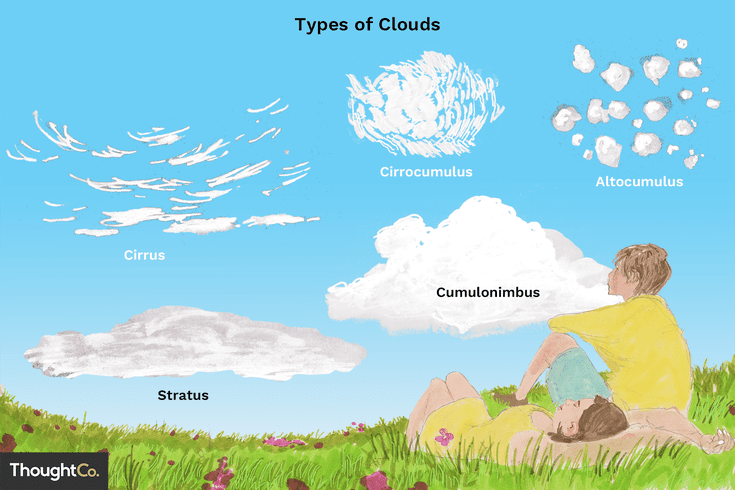
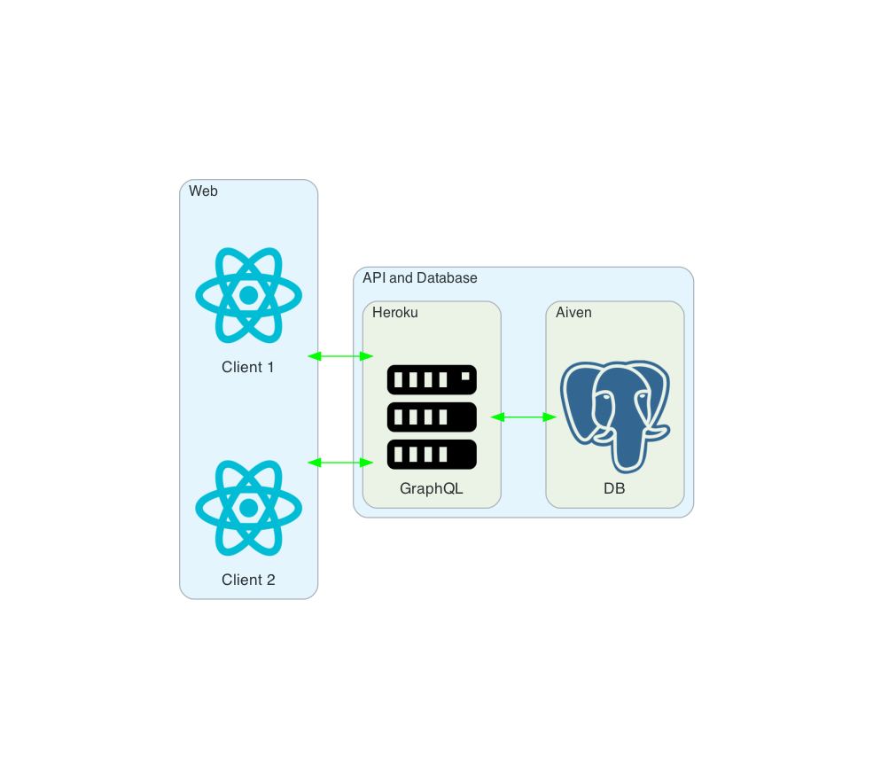
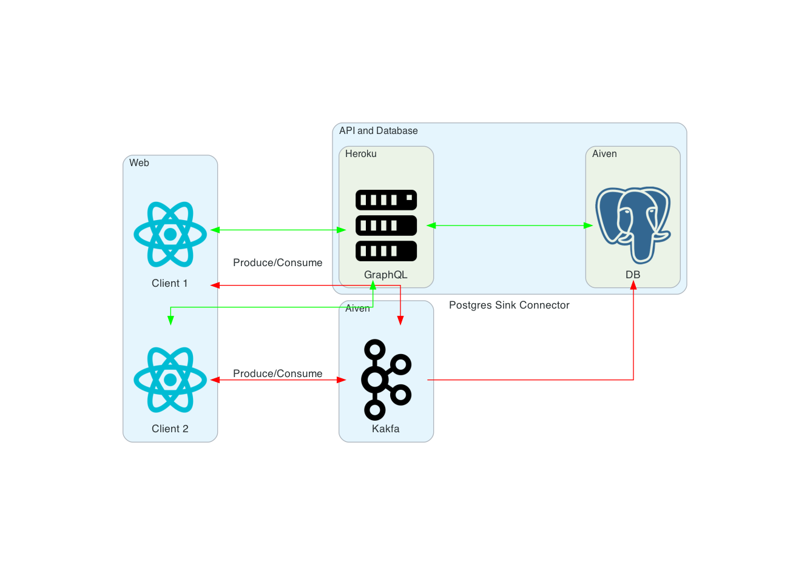
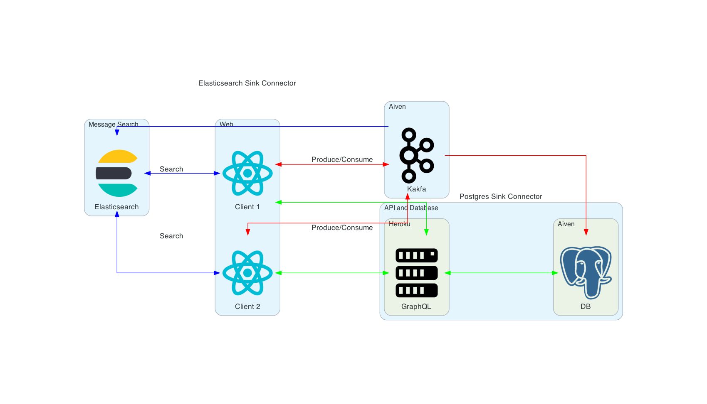
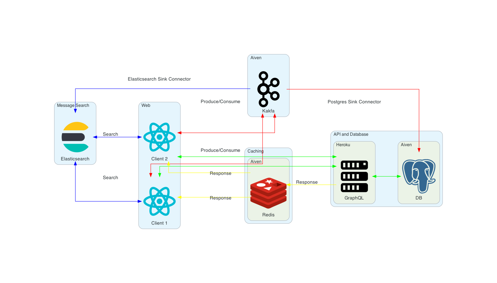
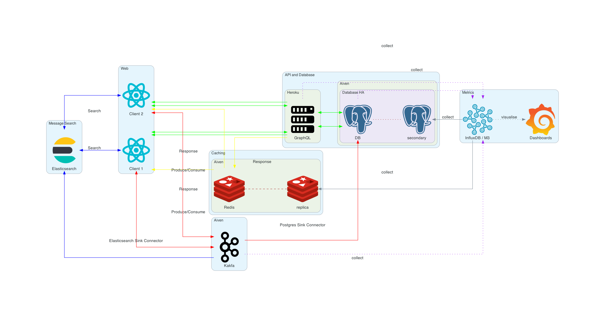

# The Slack Stack

<br/><br/><br/>
<br/>

<br/>

### Chris Gwilliams

#### Solutions Architect and OSS Enthusiast - [Aiven.io](https://aiven.io)

[chrisg@aiven.io](mailto:chrisg@aiven.io) / [github.com/encima](https://github.com/encima/) / [chris.pub](https://chris.pub)


---

## The Cloud

> The Cloud is just someone else's computer

Is this true?

What makes it different from your old Macbook wired to your router with a Static IP?

---

## Keep it Cloudy

There are 5 general types of clouds (in the sky).



Summary: Nature is complex but not over complicated

---

## Cloudy With A Chance Of... Confusion

**Amazon Web Services (AWS)** has 191 products as of [January 2020](https://medium.com/cloudpegboard/how-many-aws-services-are-there-51dda44fa946)


**Google Cloud Platform** has more than 90 and **Microsoft Azure** has ~265 (as of [September 2021](https://azure.microsoft.com/en-us/services/))

---

## From Raspberry Pi to Cloud-based, Stateless Infrastructure

There are more benefits to the cloud than using cool terms:

- Most development machines have 16GB of RAM but you are already using Zoom, Slack and other apps that require ~1GB RAM; time to offload
- Don't pay! Sites like [Vercel](https://vercel.com/) and [Heroku](https://www.heroku.com/) offer free tiers for people and most Cloud Providers will throw silly amounts of credits at you when you need more than just a VPS
- Focus! Do not spend (read: waste) your time maintaining services when there are experts with thousands of hours of experience to let you focus on creating

---

## Fail to Scale or Scale to Fail

Modifying the features, architecture or structure of your app is hard when all the services are installed and customised on your hardware.

---

## Stop Talking and Start Coding

Fine, jeez. 


Let's consider Slack (or Twake, or Mattermost, or Teams). 


These were hip applications that have grown to be mainstream and, in some cases, vital for the success of a company. So, let's build it...in less than a few hundred lines of code and totally automated (but way worse and buggy).

---

## `import requirements`

#### What do we want it to do?

1. **As a User, I want to be able to Login and Register (User Management)**
2. **As a User, I want to send Text or Media messages (Core Functionality)**
3. **As a User, I want to receive messages**
4. **As a User, I want to search messages**

---

## Our Tools

- [Terraform](https://www.terraform.io/)
- [Heroku](https://www.heroku.com/)
- [Aiven](https://aiven.io/)
- [Docker (if you want to run locally)](https://docker.com)
- [Vercel](https://vercel.com/)
- [Diagrams](https://pypi.org/project/diagrams/)

---

## The Final Product


---

## Uhhhh...wat?


OK, yeah, we are not using that.

---

## The Slack Stack (Requirement 1)

Let's start from scratch and build out as we grow. If we are making an app for our friends then maybe we want only 5 users and this initial architecture is enough...

- Frontend: [React (of course)](https://github.com/hasura/graphql-engine/tree/master/community/sample-apps/realtime-chat)
- Backend: Hasura (GraphQL)
- Database: Postgres


---

## Frontend Fun

```shell
git clone https://github.com/hasura/graphql-engine/tree/master/community/sample-apps/realtime-chat
cd realtime chat; npm i
vercel #hit y
```

---

## GraphQL Gloriousness

1. Go [here](https://hasura.io/docs/1.0/graphql/core/deployment/deployment-guides/heroku.html#deploying-hasura-with-a-new-postgres-db)
2. Click some things
3. Wait
4. Profit...

---



---

## Scaling Messages

If we are planning to grow, then we need a system that can run at scale...

Kafka is an event queue that receives data in topics and these data can then be consumed by a number of different applications. You can configure Kafka to handle different topics in different ways, to keep data for longer or even forever.

Kafka can have any number of brokers and it will `balance` itself to make sure that the data inside the topics is distributed evenly and also replicated (`backed up`).

Thinking of Slack, what do `topics` remind you of?

---



---

Each message is `produced` to a `topic` within Kafka and connected clients `consume` the message to update the chat list.

Great, now we can send millions of messages in a nanosecond. But what happens when I go on vacation for 6 months (apart from getting fired)? What about when I want to search for something?

---

## The Slack Stack (Requirements 4)

- Frontend: React (of course)
- Backend: Hasura
- Database: Postgres
- Streaming: Kafka and Kafka Connect
- Message Search: Elasticsearch

---



---

OK, now we have an architecture! Our clients can:

- receive/consume messages from Kafka
- send/produce messages to Kafka
- search messages in Elasticsearch
- cache images in Redis

---

## Moving to Production

- Frontend: React (of course)
- Backend: Hasura
- Database: Postgres
- Streaming: Kafka and Kafka Connect
- Message Search: Elasticsearch
- API Cache: Redis

---



---

## Moving to Production

### Monitoring with Metrics and Logging

`Timeseries` data is data indexed in time order. This can be useful for readings like your progress during a road trip or from your smart thermometer.

In Slacker, though, where do you think `timeseries` data would be useful?

---



---

## Moving to Production

Timeseries databases, like InfluxDB, M3DB and Timescale DB, are built specifically for these kind of use cases and we can use them to store all the metrics from all of the services we have introduced.


---

## Now What?

Hopefully you now have

- An understanding of each of the services we have covered

- An urge to not be restricted to a single Cloud Provider

- An urge to go wild with OSS

- A better naming idea than `Slacker`

- **Some questions?**

  

---

## Try This At Home, Kids

- https://github.com/hasura/graphql-engine/tree/master/community/sample-apps/realtime-chat
  - Apollo GraphQL client
  - [Apollo Kafka PubSub package](https://github.com/fmannhardt/graphql-kafka-subscriptions/packages/200307)
- [console.aiven.io](https://console.aiven.io)
- [Coming Soon](git@github.com:encima/2020-09-22-slack-stack-webinar.git)