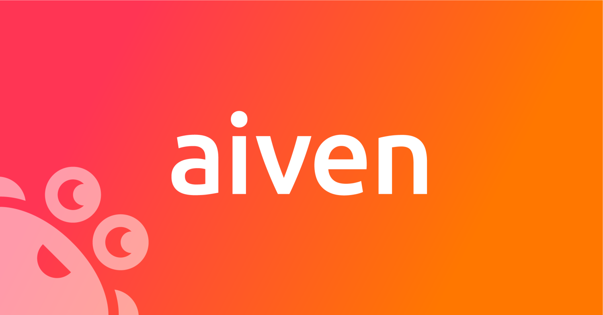

# The Slack Stack - Implementation

   
 

 

### Chris Gwilliams

#### Solutions Architect and OSS Enthusiast - [Aiven.io](https://aiven.io)

[chrisg@aiven.io](mailto:chrisg@aiven.io) / [github.com/encima](https://github.com/encima/) / [chris.pub](https://chris.pub)

---

## Step 1 - Let's make a chat app!

We want to start with a simple chat app and that needs a frontend, so let's start there! This app can be found in the `code` folder, under `app`.

## Step 2 - Make it work!

We have a website, that's cool. But it does nothing. So let's make it do something! We need to be able to store messages and users and things, how could we do that?

## Step 3 - PostgreSQL!!

The mother, father and lord of all databases: PostgreSQL. As traditional as your grandmother but much more stable.